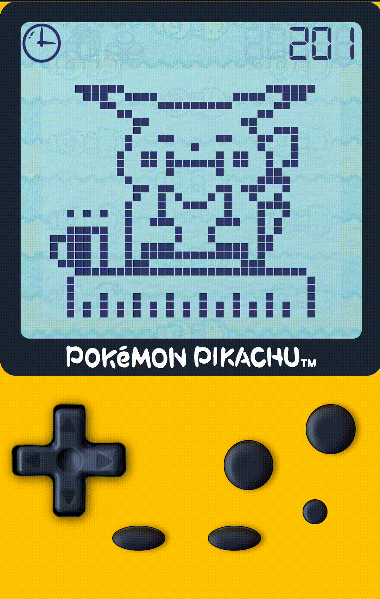

# Pocket Pikachu Emulator

- This is a web project made by a huge fan of this 90'S old toy, "pocket pikachu" only with JS
- I'm trying to replicate it by reverse engineering, watching the behavior of mine and making it here.
- I added the custom/new functionality to enable/disable the friendshipLevel dropdown.
- Still in progress, is not finished yet!
- Of course, this is a non-profit fan project, all rights to this content belong to its rightful creators.

## Actual functionalities
- Sleep Animation from 20PM to 8AM Hours (3 different possitions)
- Eat Animations at 10, 12, 16 and 18 hours (2 different animations, Bread and Onigiri)
- Play Animations randomly between 9-18 hours (SandCastle, BuildingBlocks, Lollypop, Reading)
- TV Animation randomly between 13-21 hours
- Bath anim at 19 hours
- Clock Menu (without alarm)
- Step Counter (Based on the shake button)
- Settings Menu (Reset steps and Relation Dropdown enabled, sound doesn't)
- Friendship-system (left, mad, ok, like and love states available)
- NEW Relation/FriendShip dropdown could be disabled from the settings menu; ON by default
- Slot machine (with a special hack if you walk more than 150 steps or if you loose more than 5 times)
- Gift Menu (With 8 differents animations depending the amount and friendship level)
- State of the Relation/FriendShip status

## links of interest

- [Pocket Pikachu Emulator Online](http://www.pokpik.life/)
- [Pocket Pikachu on wikipedia](https://en.wikipedia.org/wiki/Pok%C3%A9mon_Pikachu)
- [Pocket Pikachu on Bulbapedia](https://bulbapedia.bulbagarden.net/wiki/Pok%C3%A9mon_Pikachu)